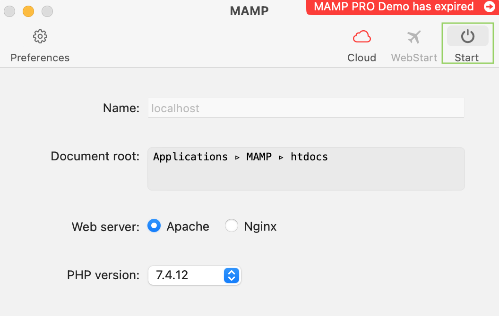

# M2 TAL : Projet Web, BD

## Présentation

Le projet de ce cours consiste à développer une interface personnelle pour pouvoir effectuer les fonctionnalités définies. Il se base sur la réalisation d’un site Internet avec interaction dynamique avec une base de données.

Le sujet s’intéresse à la proposition d’un site web de l’association des anciens élèves en master d’Inalco, dans le but de promouvoir le développement de cette plate-forme alumni.

Vous pouvez trouver plus de détails dans le [cahier des charges](cahier_Qi_WANG.pdf).

## Mode d'emploi (pour MacOS)

1. Afin de pouvoir exécuter le programme, veuillez télecharger [MAMP](https://www.mamp.info/en/downloads/), qui propose un ensemble d'outils pour le développement du web.

2. Lancer le logiciel, cliquer sur "Start", si cela fonctionne bien, vous serez dirigé(e) vers le site du MAMP. Aller sur [le serveur](http://localhost:8888/) où vous pouvez voir et importer le dossier du travail.

    

3. Ouvrir Finder, trouver le répertoire htdocs en suivant le chemin `/Applications/MAMP/htdocs`, importer tous les fichiers du travail.

4. Aller sur [PHPMyadmin](http://localhost:8888/phpMyAdmin/?lang=en), importez la base de données, [`login`](login.sql) et [`projet_final`](projet_final.sql).

5. Revenir sur [le serveur](http://localhost:8888/), vous pouvez désormais trouver le travail et visualiser le site web. 